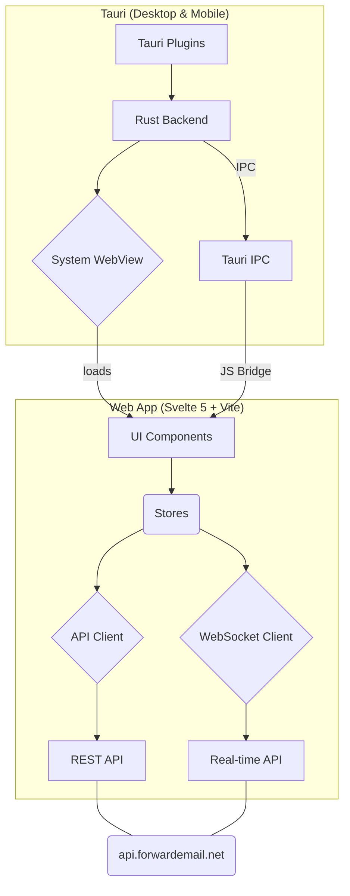

# Forward Email - Webmail, Desktop, and Mobile

This is the official, open-source, and end-to-end encrypted webmail client for [Forward Email](https://forwardemail.net). It is available as a fast and modern web app, a cross-platform desktop app for Windows, macOS, and Linux, and a native mobile app for iOS and Android.

## Downloads & Releases

All official builds are produced automatically via secure, tamper-proof [GitHub Actions workflows](https://github.com/forwardemail/mail.forwardemail.net/actions), which ensures a transparent and auditable trail from source code to the final compiled binary. Binaries for all platforms are cryptographically signed and, where applicable, notarized to ensure their authenticity and integrity. You can download the latest release from the [GitHub Releases](https://github.com/forwardemail/mail.forwardemail.net/releases) page.

| Platform    | Architecture          | Download                                                                                                                                                              | Store                     |
| :---------- | :-------------------- | :-------------------------------------------------------------------------------------------------------------------------------------------------------------------- | :------------------------ |
| **Windows** | x64                   | [`.msi` Installer](https://github.com/forwardemail/mail.forwardemail.net/releases/latest)                                                                             |                           |
| **macOS**   | Apple Silicon & Intel | [`.dmg` Universal](https://github.com/forwardemail/mail.forwardemail.net/releases/latest)                                                                             | App Store (Coming Soon)   |
| **Linux**   | x64                   | [`.deb`](https://github.com/forwardemail/mail.forwardemail.net/releases/latest), [`.AppImage`](https://github.com/forwardemail/mail.forwardemail.net/releases/latest) |                           |
| **Android** | Universal             | [`.apk`](https://github.com/forwardemail/mail.forwardemail.net/releases/latest)                                                                                       | Google Play (Coming Soon) |
|             |                       |                                                                                                                                                                       | F-Droid (Coming Soon)     |
| **iOS**     | arm64                 | App Store (Coming Soon)                                                                                                                                               |                           |

> **Note for macOS users:** If you download the `.dmg` from GitHub Releases, you may need to run the following command if you see a "damaged" or unverified app error:
>
> ```bash
> sudo xattr -rd com.apple.quarantine /Applications/ForwardEmail.app
> ```
>
> Replace `/Applications/ForwardEmail.app` with the actual path if you installed the app elsewhere.

## Security & Privacy

Security is the foundational principle of this application. We are committed to transparency and providing users with control over their data. For a detailed overview of our security practices, please see:

- [Security Policy](https://forwardemail.net/security)
- [security.txt](https://forwardemail.net/.well-known/security.txt)

### Client-Side Encryption & App Lock

The application offers a robust **App Lock** feature that enables cryptographic encryption for your entire client-side database and settings — in the browser, on desktop, or on mobile. When enabled from the **Settings > Privacy & Security** menu, all sensitive data stored locally (including message bodies, contacts, and API tokens) is encrypted at rest using the `XSalsa20-Poly1305` stream cipher from the audited `libsodium` library.

This feature can be secured using two methods:

1.  **Passkey (WebAuthn)**: For the highest level of security, you can lock and unlock the application using a FIDO2/WebAuthn-compliant authenticator. This allows you to use hardware security keys or your device's built-in biometrics. The encryption key is derived directly from the authenticator using the PRF extension, meaning the key is never stored on the device itself.
2.  **PIN Code**: For convenience, you can set a simple PIN code. This provides an iOS-like lock screen experience, ideal for quick access on mobile devices.

Our implementation supports a wide range of authenticators for Passkey-based App Lock:

| Type                        | Examples                                                                                                        |
| :-------------------------- | :-------------------------------------------------------------------------------------------------------------- |
| **Platform Authenticators** | Apple Touch ID, Face ID, Optic ID, Windows Hello, Android Biometrics (fingerprint, face)                        |
| **Hardware Security Keys**  | YubiKey 5 Series, YubiKey Bio, Google Titan, Feitian ePass/BioPass, SoloKeys, Nitrokey 3, HID Crescendo, Ledger |
| **Cloud/Software Passkeys** | iCloud Keychain, Google Password Manager, Samsung Pass, 1Password, Dashlane, Bitwarden, Proton Pass             |

### Tamper-Proof Builds

All builds are handled by public GitHub Actions workflows directly from the source code. Desktop applications are signed with platform-specific certificates (Apple Developer ID and Windows EV Code Signing) and the Tauri updater uses Ed25519 signatures to verify the integrity of every update package. All auto-updates, notifications, and IDLE-like real-time push support are handled directly between the app and our servers with zero third-party involvement.

## Features

- **Blazing Fast**: Built with Rust and Svelte 5 for a lightweight and responsive experience.
- **End-to-End Encrypted**: Cryptographic encryption for your entire client-side app — browser, desktop, or mobile.
- **Open-Source**: All code for the web, desktop, and mobile apps is available on GitHub.
- **Zero Third-Party Involvement**: Auto-updates, notifications, and real-time IDLE-like push support are handled directly by the app with no third-party servers or services involved.
- **Real-time Updates**: Mailbox updates are pushed instantly via WebSockets.
- **Cross-Platform Notifications**: Native desktop and mobile push notifications.
- **Offline Support**: A custom main-thread sync engine provides offline access and queues outgoing actions, replacing the need for a Service Worker and ensuring functionality on all platforms including Ionic/Capacitor mobile.
- **Demo Mode**: Evaluate the app's features offline without an account.
- **`mailto:` Handler**: Registers as the default email client on desktop platforms.
- **Auto-Updates**: Desktop apps automatically check for and install new versions securely.

## Architecture Overview

The application is built on a unified architecture that reuses the same Svelte 5 web application as the UI for all platforms. Tauri v2 provides the cross-platform shell, using a Rust backend for native capabilities and system webviews for rendering the UI.



For more detail, please see the full [Architecture Document](./docs/ARCHITECTURE.md).

## Tech Stack

- **Web**: Svelte 5, Vite, pnpm
- **Desktop & Mobile**: Tauri v2 (Rust backend, Svelte frontend)
- **Real-time**: WebSocket with msgpackr binary encoding
- **Encryption**: libsodium-wrappers (XSalsa20-Poly1305, Argon2id)
- **Passkeys**: @passwordless-id/webauthn (FIDO2/WebAuthn with PRF extension)
- **Testing**: Playwright for E2E tests, WebdriverIO for Tauri binary tests

## Development

See the documentation for platform-specific development guides:

- [Architecture](./docs/ARCHITECTURE.md)
- [Desktop & Mobile Development](./docs/DEVELOPMENT.md)
- [Release Process](./docs/RELEASES.md)
- [Security Hardening](./docs/SECURITY.md)
- [Push Notifications](./docs/PUSH_NOTIFICATIONS.md)
- [Tauri Testing](./docs/TAURI_TESTING.md)

### Quick Start

1.  **Install Prerequisites**: Install [Rust](https://rustup.rs/) and follow the official [Tauri v2 prerequisites](https://v2.tauri.app/start/prerequisites/) for your OS.
2.  **Install Dependencies**: `pnpm install`
3.  **Run in Dev Mode**:
    - Desktop: `pnpm tauri dev`
    - Mobile: `pnpm tauri android dev` or `pnpm tauri ios dev`
