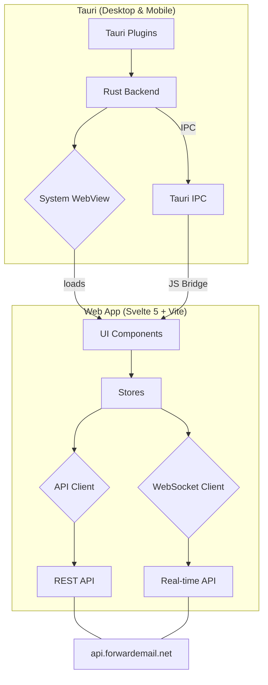

# Architecture (Tauri)

This document outlines the architecture for the Forward Email web, desktop, and mobile applications, all unified under the Tauri v2 framework.

## High-Level Overview

The core principle is to reuse the Svelte 5 + Vite web application as the UI layer for all platforms. Tauri provides the cross-platform shell, using a Rust backend for native capabilities and system webviews for rendering the UI.

## Components

### 1. Web Application (Svelte 5)

- **UI**: The existing Svelte 5 components, stores, and styles are the foundation for all platforms.
- **API Client**: The existing `ky`-based REST client handles standard API requests.
- **WebSocket Client**: A dedicated WebSocket client (`src/utils/websocket-client.js`) handles real-time updates.

### 2. Tauri Application (Desktop & Mobile)

- **`src-tauri/`**: The Rust backend for the application.
  - **`main.rs` / `lib.rs`**: The Rust entry points. This is where the Tauri application is configured, plugins are registered, and native IPC commands are defined.
  - **`tauri.conf.json`**: The central configuration file for all Tauri features, including window setup, plugin configuration, bundle identifiers, and security settings.
  - **`Cargo.toml`**: Manages Rust dependencies, including Tauri and its plugins.
- **Tauri IPC**: The Inter-Process Communication bridge that allows the Svelte frontend to securely call Rust functions. All exposed Rust functions are explicitly defined with the `#[tauri::command]` attribute.
- **Tauri Plugins**: We leverage several official Tauri plugins to provide native functionality:
  - `tauri-plugin-updater`: For automatic background updates on desktop.
  - `tauri-plugin-notification`: For native desktop and mobile push notifications.
  - `tauri-plugin-deep-link`: To handle `forwardemail://` custom protocol URLs.
  - `tauri-plugin-single-instance`: Ensures only one instance of the desktop app can run.
  - `tauri-plugin-window-state`: Persists window size and position on desktop.

### 3. Platform-Agnostic Bridges

To keep the core application logic clean and reusable, we use several bridge modules:

- **`src/utils/platform.js`**: A simple utility to detect the current runtime environment (`isTauri`, `isWeb`, `canUseServiceWorker`).
- **`src/utils/tauri-bridge.js`**: Initializes all Tauri-specific event listeners and frontend functionality.
- **`src/utils/notification-bridge.js`**: A wrapper that uses either the native Tauri notification plugin or the web Notifications API, depending on the platform.
- **`src/utils/sync-bridge.js`**: The entry point for our offline sync mechanism (see below).

## Service Worker Alternative: The Sync Shim

Since Service Workers are not supported in Tauri's webview, we've implemented a custom "sync shim" to provide offline functionality across all platforms.

1.  **`src/utils/sync-core.js`**: This is a platform-agnostic module containing the core logic for handling API synchronization and processing a mutation queue from IndexedDB. It is designed as a factory function that accepts an environment object (`fetch`, `indexedDB`, `postMessage`).

2.  **`public/sw-sync.js`**: This is the **Service Worker adapter**. It runs only in the web version. It imports `sync-core.js` and provides the Service Worker environment bindings (e.g., `self.fetch`, `self.indexedDB`, and `self.clients.matchAll().then(...)` for `postMessage`). It is triggered by the `sync` and `periodicsync` events.

3.  **`src/utils/sync-shim.js`**: This is the **main-thread replacement** for the Service Worker, used in all Tauri builds. It also imports `sync-core.js` but provides main-thread environment bindings (`window.fetch`, `window.indexedDB`, and a `CustomEvent`-based `postMessage`). It is triggered by `online` events, `visibilitychange` events, and a simple `setInterval` heartbeat.

4.  **`src/utils/sync-bridge.js`**: This is a unified module that detects the platform at runtime. It initializes either the Service Worker (on the web) or the sync shim (in Tauri). The rest of the application interacts only with this bridge, making all calls to the sync layer platform-agnostic.

This architecture allows us to share the exact same complex synchronization logic between the web and native apps, ensuring consistent behavior and reducing code duplication.

## Client-Side Encryption and App Lock

The application provides an optional App Lock feature that encrypts all locally stored data at rest.

### Encryption Architecture

- **`src/utils/crypto-store.js`**: The core encryption module. Implements envelope encryption using libsodium (`XSalsa20-Poly1305` via `crypto_secretbox`). A random Data Encryption Key (DEK) encrypts all data. The DEK is itself encrypted by a Key Encryption Key (KEK) derived from the user's PIN (via Argon2id) or passkey (via WebAuthn PRF + HKDF). Provides `encryptRecord()` / `decryptRecord()` functions for the database layer, and `encryptSensitiveLocal()` / `decryptSensitiveLocal()` for localStorage values.

- **`src/utils/passkey-auth.js`**: WebAuthn passkey registration and authentication using `@passwordless-id/webauthn`. Supports the PRF extension for deriving encryption keys directly from the authenticator. Falls back to PIN-based KEK derivation when PRF is unavailable.

### Lock Screen

- **`src/svelte/LockScreen.svelte`**: An iOS-style lock screen overlay with a numeric PIN pad and passkey authentication button. Renders as a full-viewport overlay at z-index 999999, blocking all app interaction until unlocked. Includes shake animation on wrong PIN and exponential backoff lockout.

- **`src/svelte/AppLockSettings.svelte`**: The settings UI in Privacy & Security tab (above PGP encryption). Allows enabling/disabling App Lock, setting up PIN or passkey, configuring inactivity timeout, and changing the PIN.

- **`src/utils/inactivity-timer.js`**: Monitors user activity (mouse, keyboard, touch, scroll) and triggers auto-lock after the configured timeout. Supports configurable timeouts from 1 minute to 1 hour.

### Data Flow

1. On first setup, a random DEK is generated and encrypted with the KEK derived from the user's PIN.
2. On app start, if App Lock is enabled, the lock screen is shown before any content renders.
3. On successful unlock, the KEK is derived, the DEK is decrypted, and held in a module-scoped closure.
4. All IndexedDB writes pass through `encryptRecord()` which encrypts non-indexed fields with the DEK.
5. All IndexedDB reads pass through `decryptRecord()` which decrypts the fields transparently.
6. On lock (manual or inactivity), `sodium.memzero()` wipes the DEK from memory.

## Build Process

1.  The web application is built using Vite (`pnpm build`).
2.  `pnpm tauri build` is executed.
3.  The `tauri-action` GitHub Action orchestrates the entire build, signing, and packaging process for all target platforms (macOS, Windows, Linux, Android, iOS).

## Release Flow

1.  A new version is tagged (e.g., `v1.2.3`) and pushed to GitHub.
2.  The `release-desktop.yml` and `release-mobile.yml` GitHub Actions workflows are triggered.
3.  The workflows build, sign, and (on macOS) notarize all application binaries.
4.  The compiled artifacts are uploaded to a draft GitHub Release.
5.  Once the draft is published, the `newRelease` WebSocket event is broadcast to all connected clients, and the Tauri desktop app's auto-updater will detect and download the new version.
