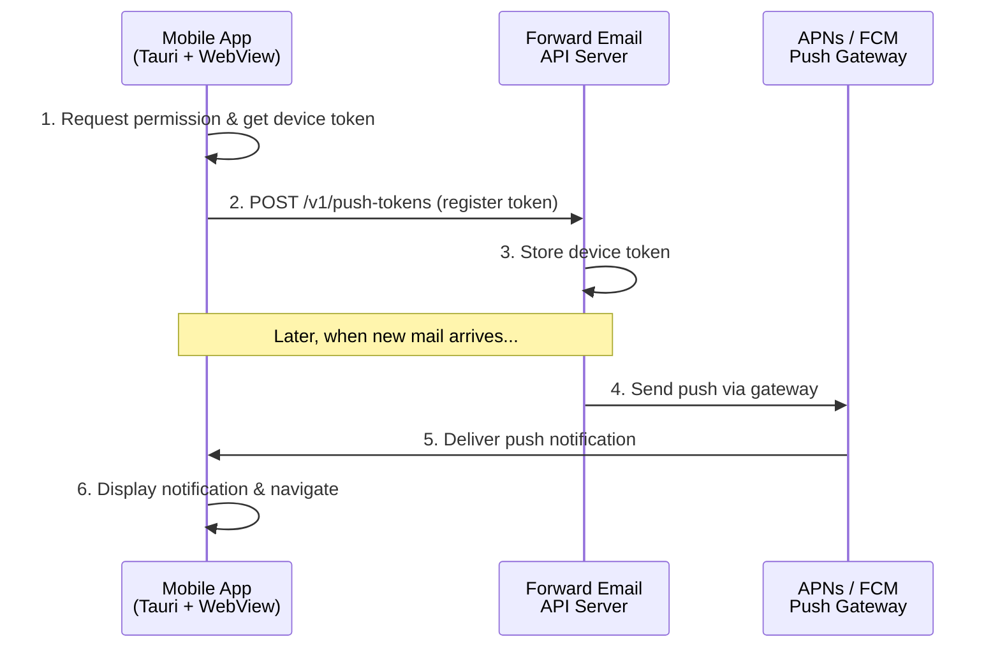

# Push Notifications Setup Guide

This document describes how to set up push notifications for the Forward Email
Tauri mobile apps on iOS (APNs) and Android (FCM).

## Architecture Overview



### Flow

1. **App Launch**: The Tauri app requests push notification permission from the
   OS and obtains a device token (APNs token on iOS, FCM registration token on
   Android).

2. **Token Registration**: The device token is sent to the Forward Email API
   server via `POST /v1/push-tokens` with the user's authentication token.

3. **Server-Side Push**: When new mail arrives for the user, the server sends a
   push notification via APNs (iOS) or FCM (Android) using the stored device
   token.

4. **Notification Display**: The OS displays the notification even if the app is
   backgrounded or closed. Tapping the notification opens the app and navigates
   to the relevant message.

## iOS Setup (APNs)

### Prerequisites

- Apple Developer Program membership
- Xcode installed on macOS
- A physical iOS device (push notifications do not work in the simulator)

### Step 1: Enable Push Notifications Capability

1. Open the Tauri iOS project in Xcode:

   ```bash
   cd src-tauri/gen/apple
   open ForwardEmail.xcodeproj
   ```

2. Select the project target → **Signing & Capabilities**.

3. Click **+ Capability** → Add **Push Notifications**.

4. Also add **Background Modes** and check **Remote notifications**.

### Step 2: Create APNs Key

1. Go to [Apple Developer Portal](https://developer.apple.com/account/resources/authkeys/list).

2. Click **Keys** → **Create a Key**.

3. Enter a name (e.g., "Forward Email Push Key").

4. Check **Apple Push Notifications service (APNs)**.

5. Click **Continue** → **Register**.

6. Download the `.p8` key file. **Save it securely — it can only be downloaded once.**

7. Note the **Key ID** and your **Team ID** (visible in the top-right of the portal).

### Step 3: Configure Server Environment

Set the following environment variables on the Forward Email API server:

```env
# APNs Configuration
APNS_KEY_ID=ABC123DEFG          # Your APNs Key ID
APNS_TEAM_ID=TEAM123456         # Your Apple Developer Team ID
APNS_KEY_PATH=/path/to/AuthKey_ABC123DEFG.p8  # Path to the .p8 key file
APNS_BUNDLE_ID=net.forwardemail.mail           # Must match the app bundle ID
APNS_PRODUCTION=true             # false for sandbox/development

# Alternative: Base64-encoded key (for cloud deployments)
# APNS_KEY_BASE64=LS0tLS1CRUdJTi...
```

### Step 4: Update Entitlements

The `Entitlements.plist` should include:

```xml
<key>aps-environment</key>
<string>production</string>
```

For development builds, use `development` instead of `production`.

### Step 5: Server-Side APNs Integration

The server should use a library like `apns2` (Node.js) or `a2` (Rust) to send
push notifications:

```javascript
// Example: Node.js server-side APNs push
const apn = require('apn');

const provider = new apn.Provider({
  token: {
    key: process.env.APNS_KEY_PATH,
    keyId: process.env.APNS_KEY_ID,
    teamId: process.env.APNS_TEAM_ID,
  },
  production: process.env.APNS_PRODUCTION === 'true',
});

async function sendPushNotification(deviceToken, { title, body, data }) {
  const notification = new apn.Notification();
  notification.alert = { title, body };
  notification.topic = process.env.APNS_BUNDLE_ID;
  notification.badge = data.unreadCount || 1;
  notification.sound = 'default';
  notification.payload = { type: 'new-message', ...data };

  const result = await provider.send(notification, deviceToken);
  return result;
}
```

## Android Setup (FCM)

### Prerequisites

- Google account with Firebase access
- Android SDK installed

### Step 1: Create Firebase Project

1. Go to [Firebase Console](https://console.firebase.google.com/).

2. Click **Add project** → Enter "Forward Email" → Continue.

3. Disable Google Analytics (optional) → **Create project**.

### Step 2: Add Android App to Firebase

1. In the Firebase project, click **Add app** → **Android**.

2. Enter the package name: `net.forwardemail.mail`

3. Enter the app nickname: "Forward Email"

4. Download `google-services.json`.

5. Place it in `src-tauri/gen/android/app/google-services.json`.

### Step 3: Get Server Key

1. In Firebase Console → **Project Settings** → **Cloud Messaging** tab.

2. If FCM API (V1) is enabled, note the **Sender ID**.

3. For the server, you'll use a **Service Account** key:
   - Go to **Project Settings** → **Service accounts**.
   - Click **Generate new private key**.
   - Download the JSON key file.

### Step 4: Configure Server Environment

```env
# FCM Configuration
FCM_PROJECT_ID=forward-email-12345       # Your Firebase project ID
FCM_SERVICE_ACCOUNT_PATH=/path/to/service-account.json
# Alternative: Base64-encoded service account JSON
# FCM_SERVICE_ACCOUNT_BASE64=eyJ0eXBlIjoi...
```

### Step 5: Server-Side FCM Integration

```javascript
// Example: Node.js server-side FCM push (using firebase-admin)
const admin = require('firebase-admin');

admin.initializeApp({
  credential: admin.credential.cert(
    JSON.parse(fs.readFileSync(process.env.FCM_SERVICE_ACCOUNT_PATH, 'utf8')),
  ),
});

async function sendPushNotification(deviceToken, { title, body, data }) {
  const message = {
    token: deviceToken,
    notification: { title, body },
    data: {
      type: 'new-message',
      uid: String(data.uid || ''),
      mailbox: data.mailbox || 'INBOX',
    },
    android: {
      priority: 'high',
      notification: {
        channelId: 'new-mail',
        sound: 'default',
        clickAction: 'OPEN_MAIL',
      },
    },
  };

  const response = await admin.messaging().send(message);
  return response;
}
```

## Push Notification Payload Format

All push notifications from the Forward Email server should use this payload
format:

```json
{
  "type": "new-message",
  "uid": "12345",
  "mailbox": "INBOX",
  "from": "sender@example.com",
  "subject": "Hello World",
  "unreadCount": 5
}
```

### Supported Types

| Type             | Description                    | Navigation Target |
| ---------------- | ------------------------------ | ----------------- |
| `new-message`    | New email received             | `#INBOX/{uid}`    |
| `calendar-event` | Calendar event created/updated | `#calendar`       |
| `contact-update` | Contact created/updated        | `#contacts`       |

## Client-Side Integration

The client-side push notification handling is in `src/utils/push-notifications.js`.

### Initialization

```javascript
import { initPushNotifications } from './utils/push-notifications.js';

// Call after user signs in
await initPushNotifications({
  authToken: userAuthToken,
});
```

### Cleanup

```javascript
import { cleanupPushNotifications } from './utils/push-notifications.js';

// Call on sign-out
await cleanupPushNotifications(userAuthToken);
```

## Environment Variables Summary

### Server-Side (API Server)

| Variable                   | Required | Description                                |
| -------------------------- | -------- | ------------------------------------------ |
| `APNS_KEY_ID`              | iOS      | APNs authentication key ID                 |
| `APNS_TEAM_ID`             | iOS      | Apple Developer Team ID                    |
| `APNS_KEY_PATH`            | iOS      | Path to `.p8` key file                     |
| `APNS_BUNDLE_ID`           | iOS      | App bundle identifier                      |
| `APNS_PRODUCTION`          | iOS      | `true` for production, `false` for sandbox |
| `FCM_PROJECT_ID`           | Android  | Firebase project ID                        |
| `FCM_SERVICE_ACCOUNT_PATH` | Android  | Path to service account JSON               |

### Client-Side (`.env`)

No additional client-side environment variables are needed. The push token
registration endpoint is hardcoded to the Forward Email API.

## Testing

### iOS Testing

1. Build the app for a physical device (not simulator).
2. Sign in and grant notification permission.
3. Background the app.
4. Send an email to the signed-in account.
5. Verify the push notification appears.

### Android Testing

1. Build the app and install on a device or emulator with Google Play Services.
2. Sign in and grant notification permission.
3. Background the app.
4. Send an email to the signed-in account.
5. Verify the push notification appears.

### Token Registration Testing

Use the Forward Email API to verify token registration:

```bash
curl -X GET https://api.forwardemail.net/v1/push-tokens \
  -H "Authorization: Bearer YOUR_AUTH_TOKEN"
```

## Troubleshooting

### iOS

- **No token received**: Ensure Push Notifications capability is enabled in
  Xcode and the provisioning profile includes push notifications.
- **Notifications not delivered**: Check that `aps-environment` in entitlements
  matches the APNs environment (sandbox vs production).
- **Token invalid**: APNs tokens are environment-specific. A sandbox token won't
  work with the production APNs endpoint.

### Android

- **No token received**: Ensure `google-services.json` is in the correct
  location and the Firebase project is properly configured.
- **Notifications not shown**: Check that the notification channel (`new-mail`)
  is created and not disabled by the user in system settings.
- **FCM quota exceeded**: Firebase has daily limits for free-tier projects.
  Consider upgrading to the Blaze plan for production use.
